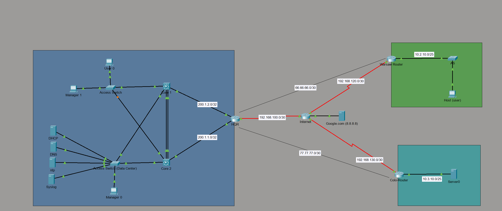

# Meridian Systems — Distributed Enterprise Network

A multi-site network built in Cisco Packet Tracer, connecting a headquarters, a branch office, and a disaster-recovery/colo site over site-to-site GRE tunnels protected by IPsec, with multi-area OSPF as the internal routing protocol. Built as a follow-on to the [SecureCorp](https://github.com/PedyS/Corp-enterprise-network) project, focused on protocol depth (OSPF areas, GRE, IPsec, NAT) rather than repeated switching/scale configuration.

## Scenario

Meridian Systems is headquartered in Amsterdam, with a smaller engineering office in Warsaw and a colocated backup/DR site reachable only over the public internet. Rather than leased MPLS circuits, the three sites are connected using site-to-site VPN over the internet — an increasingly common pattern for mid-size, multi-country companies. Every site is represented by the minimum device count needed to prove the design works, not a full-scale office headcount.

## Topology

- **HQ (Amsterdam):** Core1 and Core2 (LACP EtherChannel, HSRP per VLAN), two access switches — one general access, one dedicated to servers (DHCP, DNS, NTP) — and HQ-RTR, which is the OSPF Area 0 router, the GRE tunnel hub for both spokes, and the NAT/PAT edge.
- **Warsaw:** a single router (Area 1, totally stubby), local switch, local DHCP pool.
- **DR/Colo:** a single router (Area 2, totally stubby), local switch, local DHCP pool.
- **Internet router:** represents the public internet. Has a route only to the three sites' directly-facing links, nothing pointing back into any private address space — mirrors how a real ISP edge router behaves.

## IP Addressing

| Site | VLAN | Purpose | Network | Mask |
|---|---|---|---|---|
| HQ | 10 | Users | 10.1.10.0 | /25 |
| HQ | 20 | Unused — placeholder for a wireless site that was attempted and removed | 10.1.20.0 | /25 |
| HQ | 30 | Servers | 10.1.30.0 | /28 |
| HQ | 100 | Management | 10.1.100.0 | /28 |
| Warsaw | — | Area 1 LAN | 10.2.10.0 | /25 |
| DR | — | Area 2 LAN | 10.3.10.0 | /25 |

**Tunnels and loopbacks**

| Purpose | Network/Address | Mask |
|---|---|---|
| Tunnel10 (HQ ↔ Warsaw) | 66.66.66.0 | /30 |
| Tunnel20 (HQ ↔ DR) | 77.77.77.0 | /30 |
| HQ-RTR Loopback0 | 1.1.1.1 | /32 |
| Warsaw router Loopback0 | 2.2.2.2 | /32 |
| DR router Loopback0 | 3.3.3.3 | /32 |

**Public-facing links (simulated ISP)**

| Site | Network | Mask |
|---|---|---|
| HQ | 192.168.100.0 | /30 |
| Warsaw | 192.168.120.0 | /30 |
| DR | 192.168.130.0 | /30 |

## Routing — OSPF

- **Area 0 (backbone):** HQ-RTR's LAN-facing side and both tunnel interfaces (Tunnel10, Tunnel20). Putting the tunnels in Area 0 makes both Warsaw's and DR's routers ABRs without ever needing a virtual link, since every ABR touches the backbone directly.
- **Area 1 (Warsaw)** and **Area 2 (DR):** both configured as totally stubby. Neither site needs visibility into every external or inter-area route — only a single default route toward HQ, which totally stubby areas provide automatically as part of the area type itself, with no separate `default-information originate` command required.
- **NSSA was considered and rejected** for both areas: NSSA's value is letting a stub-family area originate its own external routes, and neither Warsaw nor DR has a local internet breakout to originate. Totally stubby achieves everything actually required with less complexity.
- **Loopbacks are explicitly advertised** into each router's own area with a `/32` `network` statement — a loopback isn't automatically included in OSPF just because it exists, and this was an early build bug (loopbacks weren't reachable company-wide until each was added individually).

## WAN — GRE + IPsec

- Two independent point-to-point GRE tunnels, both hubbed at HQ-RTR, sourced from each router's Loopback0.
- Both protected with a crypto map (ISAKMP + IPsec, pre-shared key), not the newer `tunnel protection ipsec profile` method — that command wasn't available in this Packet Tracer version.
- The crypto ACL matches the GRE-encapsulated outer packet between the two public tunnel endpoints, not the inner private subnets — the inner traffic is protected as a consequence of the outer GRE packet being encrypted, not matched directly.
- No NAT exemption was needed for the tunnel traffic: the tunnel's source is each router's loopback, which never falls inside the internal-subnet NAT ACL, and more fundamentally, GRE tunnel packets are generated locally by the router process itself rather than forwarded transit traffic, so they were never part of the inside-to-outside NAT translation path to begin with.

## Routing to the internet

- Warsaw and DR each use a **specific host static route** to HQ-RTR's public IP only, rather than a full `0.0.0.0/0` default — since neither site has its own internet breakout, a host route reflects the actual design intent (this link exists only to establish the tunnel) rather than implying general internet access that doesn't exist.
- HQ-RTR holds the only real default route, pointed at the internet router.
- All internal subnets — HQ, Warsaw, and DR — are permitted in HQ-RTR's NAT source list and translated via PAT on the outside interface.

## Services

- DHCP, DNS, and NTP are centralized at HQ.
- Warsaw and DR each run their own **local DHCP pool** rather than relaying to HQ across the tunnel — a deliberate change from the original centralized design, so each branch keeps issuing leases even if its tunnel to HQ is down.
- Syslog was not implemented in this project — centralized logging was already demonstrated in the SecureCorp project, and wasn't repeated here.

## Security & Management

- Device-access hardening — SSH-only, VTY `access-class` restriction, `enable secret` — was already demonstrated fully in the SecureCorp project and was intentionally left out of scope here, so this project could focus on OSPF/VPN/NAT depth instead.

## Known Limitations (Packet Tracer vs. Production)

- `tunnel protection ipsec profile` unavailable — GRE/IPsec configured with the classic crypto map + ACL method instead.
- `ip ospf <process> area <id>` interface-level command unavailable — areas assigned via `network` statements with exact-match (`0.0.0.0`) wildcard masks instead.
- **Wireless was attempted and removed.** A WLC and AP were configured, the AP was discovered by the controller, and WLANs/dynamic interfaces were configured for a Corporate and Guest SSID — but no SSID ever broadcast, and the cause wasn't identified. Removed from scope rather than left half-working; VLAN 20 (originally Guest WiFi) is kept unused in the addressing table as a record of the attempt.

## Lessons Learned

- Every router needs either a direct or virtual connection to Area 0 — there's no way for a non-backbone area to reach another non-backbone area without transiting the backbone, which is why the GRE tunnels were deliberately placed in Area 0 rather than Area 1/2.
- Stub area configuration must be applied consistently on both ends of the relationship — the ABR (`area X stub no-summary`) and the internal router (`area X stub`) use different commands for different reasons, and both sides must agree the area is stub-type at all.
- IPsec has two real configuration approaches — crypto maps applied to a physical interface with a matching ACL, or an IPsec profile applied directly to a tunnel interface. Only the crypto map method was available in this Packet Tracer version.
- An OSPF area-ID mismatch between two directly connected routers produces an explicit, specific log message rather than a silent failure — worth checking `show ip ospf interface` on both sides whenever this appears, since it means the two sides simply disagree on which area that link belongs to.
